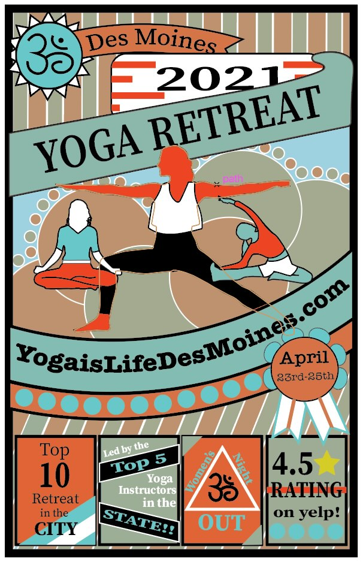
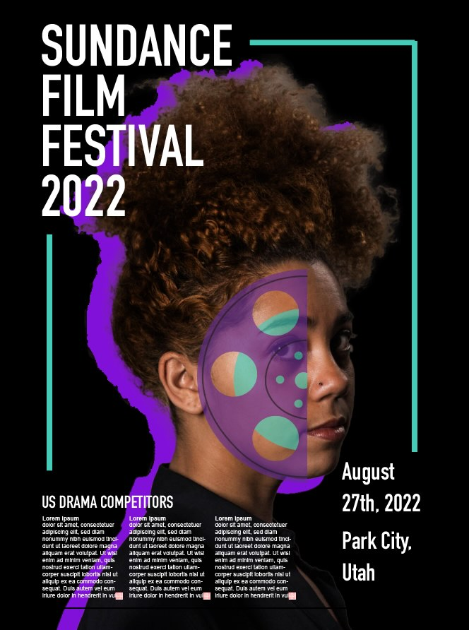
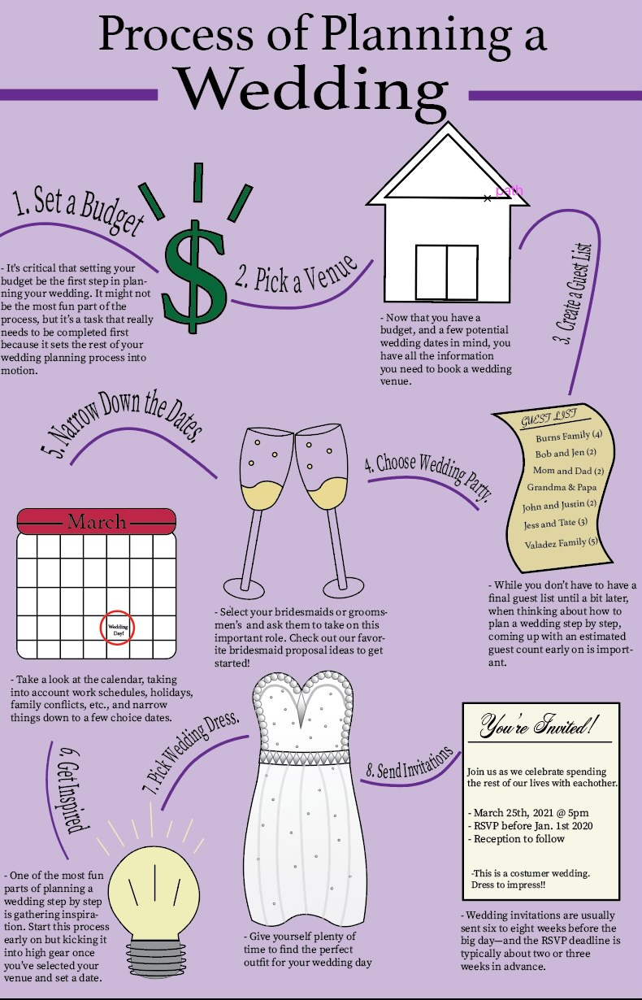
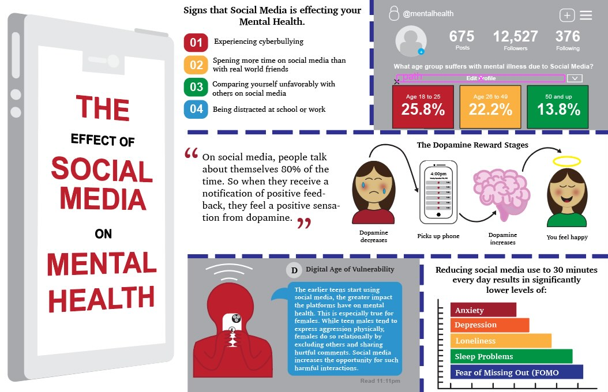
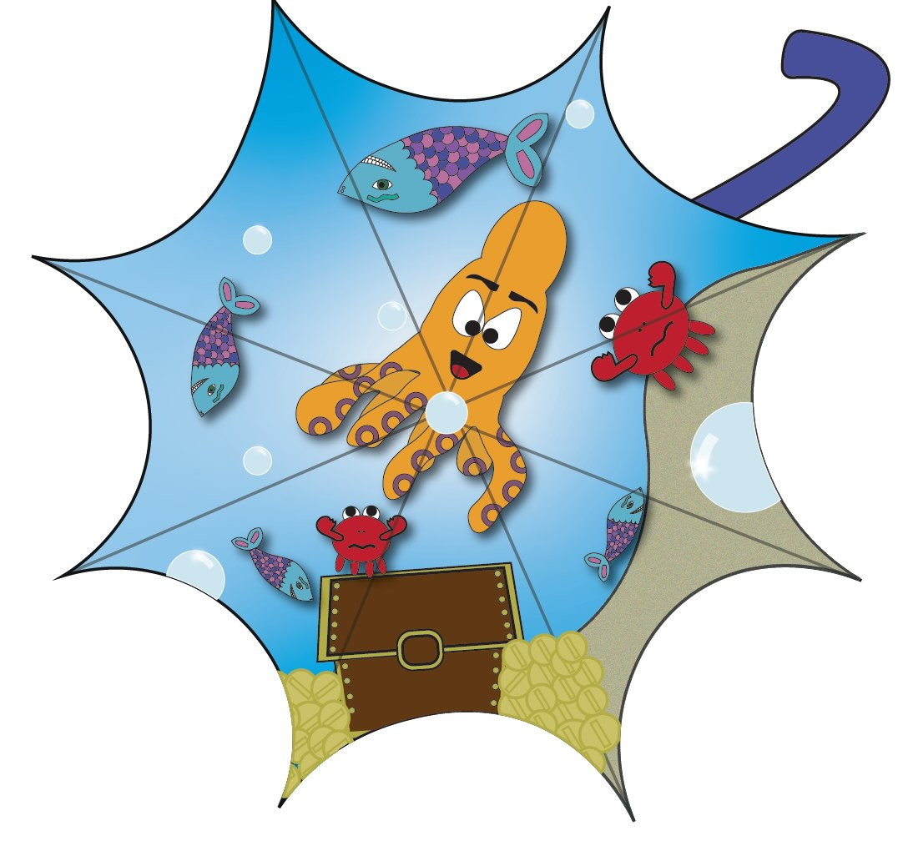
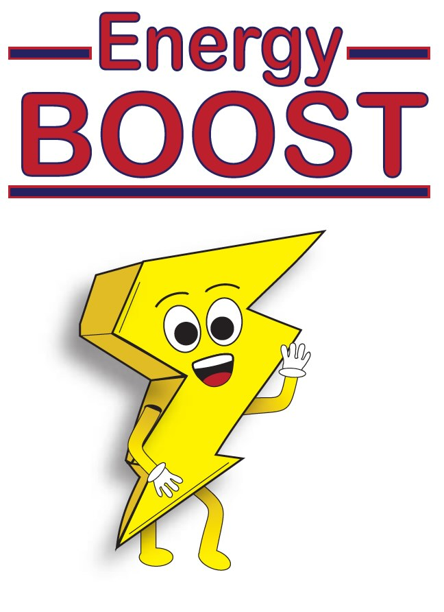
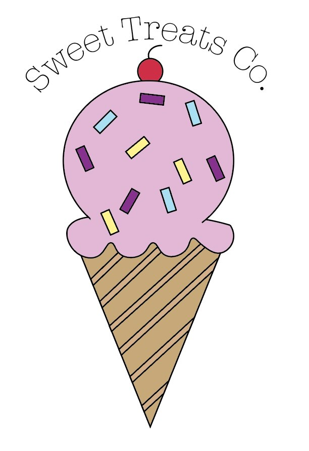
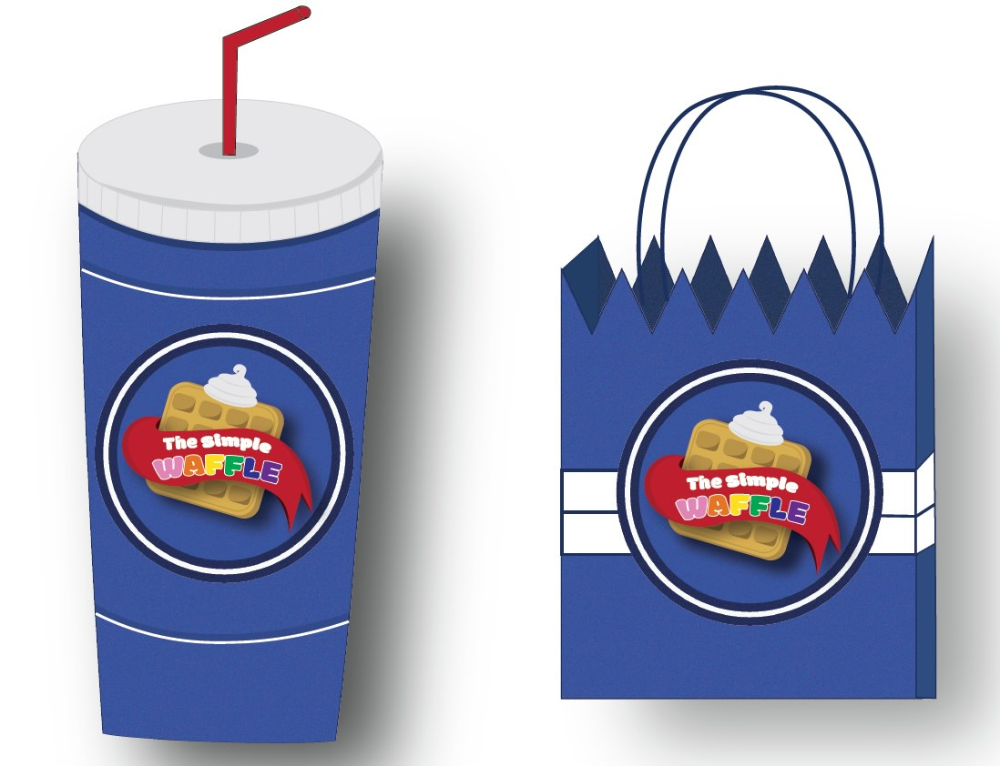

Inside look of GD
=================

Apps and Programs
-----------------

The classes within the graphic design department come in many different shapes
and forms, but we are not able to accomplish these projects without the apps that
come along within this major. The main apps used when it comes to the graphic
design department are, but are not limited to:

* Adobe Apps

    * Illustrator
    * InDesign
    * Photoshop
* Programming Apps

    * Pycharm
    * Sublime
    * Tiles

Some may think knowing all these apps is a must before starting the major, but
that is not the case at all. With the help from professors at Simpson, they will
help you every step of the way to help you understand each program.

Here are some examples of my work from almost each course and the projects that
will come up within some of the classes:

Examples
--------

Posters
^^^^^^^

|pic 1| |pic 2|

Posters are a huge part of advertising in the graphic design industry and are a
key skill to design. There are people who always need a poster for someone's
event, party, volunteer opportunities, bake sale, etc.

Whatever the case may be,poster design is a place where you are able to have
fun and play around with different colors, but also learning the key components
of coloration, typography,and layout when it comes to making a professional
looking poster.

*This type of project would happen in GDSN 136, 236, and 336.*

Infographics
^^^^^^^^^^^^

|pic 3| |pic 4|

Don’t get me started on infographics…. They are one of my favorite projects to do!
There are so many different topics you get to choose from that you believe is
informational to those who are interested in that topic. With infographics, you
are able to put facts into a poster that will catch the eye of consumers.

As you can see above, the designs correlate with the topic I chose to make sure
it comes all together. Infographics are big in the graphic design world to get
information out to the public and grab people's attention.

*This type of project would happen in GDSN 136, 236, and 336.*

Illustrations
^^^^^^^^^^^^^

|pic 5| |pic 6|

When it comes to illustrations, all I think about are cartoons. But when it comes
to drawing and illustrations, it is really your own imagination. In GDSN 248,
there were a lot of people who saw their projects as their own and our professor,
Justin Nostrala, encouraged us with what we thought would be best for the project
and with our skills.

I promise you this when I say it, you don’t have to be a talented illustrator to
be a graphic designer. It is about the product you produce when putting it into
Adobe Creative Suite apps to make your project come to life.

*This type of project would happen in GDSN 248.*

Branding
^^^^^^^^

|pic 7| |pic 8|

Branding. Branding. BRANDING!

This is what graphic design is all about. When looking at the Simpson College logo,
t-shirts, brochures, bookstore items, etc. that is all considered branding. Each
company/organization to make them stand out from other competitors. Us at graphic
designers need to help companies show we understand their brand and how to make
everything flow together easily in a professional way.

*This type of project would happen in GDSN 136, 236, and 336.*
