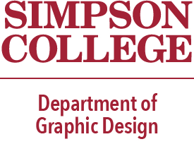

Graphic Design Overview
=======================

Graphic design can influence the way we live, work and play. The presentation
of a design has the power to inspire, incite, unite and spark change. By
understanding and harnessing that power, you have the potential to change the
world. [#f2]_

You'll find a healthy balance of guided learning combined with the freedom to
find your own artistic expression. [#f2]_

Course Requirements
-------------------

**Graphic Design Major** [#f2]_

========= ======== =========================
Subject   Number   Description
========= ======== =========================
GDSN      136      Graphic Design I
GDSN      236      Graphic Design II
GDSN      336      Graphic Design III
GDSN      246      Digital Design
GDSN      237      Digital Photography
GDSN      248      Illustration
CMSC      150      Intro to Programming
CIS       120      Web Development
COMM      101      Intro to Communications
GDSN      319      Graphic Design Internship
GDSN      385      Senior Seminar
========= ======== =========================

**Graphic Design Minor** [#f2]_

========= ======== ========================
Subject   Number   Description
========= ======== ========================
GDSN      136      Graphic Design I
GDSN      236      Graphic Design II
GDSN      336      Graphic Design III
GDSN      237      Digital Photography
GDSN      248      Illustration
========= ======== ========================

Potential Jobs for the Future
-----------------------------

When it comes to the world of graphic design, there is a broad range of options
when it comes to finding a job. Here are some examples of potential jobs in the
graphic design agency.

* Graphic Designer

    * Graphic designers develop graphics and layouts for product illustrations,
      company logos, websites, and more. This job title can cover a huge range of
      duties in a huge range of industries [#f1]_
* User Experience (UX) Designer

    * UX designers work to make products, processes, and services seamless,
      enjoyable, and intuitive for users. They think about how the product feels,
      how users will use it. They ensure the product flows from one step to the
      next. [#f1]_
* Marketing Specialist

    * Marketing specialists collect and analyze data on target customers,
      initiate marketing campaigns, measure the effectiveness of marketing attempts
      and create strategies to promote their company and its goods or services. [#f1]_
* Multimedia Artist or animator

    * Multimedia artists and animators design complex graphics and animation
      using computer animation or modeling programs. They think about story
      development, visual impact, and platforms to create media content that will
      meet their employer’s objectives. [#f1]_
* Freelancer

    * While it’s not a unique design job in its own right, but most of the job
      titles mentioned above can be performed as a freelancer. Designers who have
      some experience on their resume, a stunning portfolio of work, or expertise
      in niche areas of design, marketing, and graphics could build a career finding
      freelance projects. [#f1]_
* Art Director

    * Art directors take charge of the visual style and content in magazines,
      newspapers, product packaging and movie, and television productions. They
      create designs and direct other artists to develop each contributing piece. [#f1]_

.. [#f1] "`What Can You Do with a Graphic Design Degree? <https://www.rasmussen.edu/
   degrees/design/blog/what-can-you-do-with-graphic-design-degree/>`_".
   Brianna Falvin. 2020. Retrieved 2021-12-7.

.. [#f2] "`Simpson College - Graphic Design <https://simpson.edu/academics/departments/
   academics/graphic-design/>`_".
   Simpson College. 2020. Retrieved 2021-12-7.
